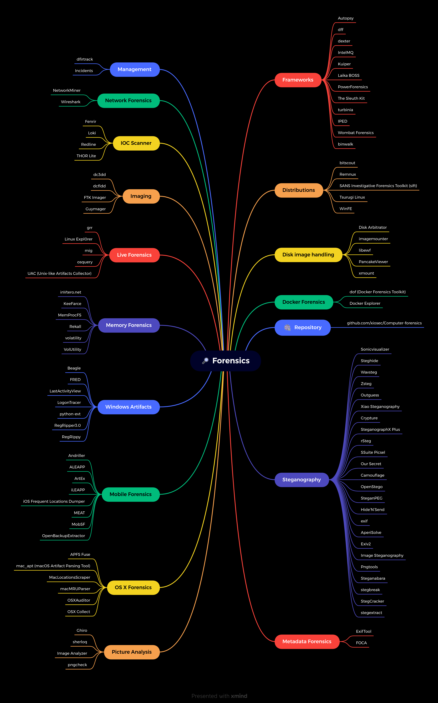

# 🕵️‍♂️ Computer Forensics 

Curated list of awesome free forensic analysis tools and resources.

 
* [Computer Forensics](https://github.com/xiosec/Computer-forensics)
  * [Distributions](#-distributions)
  * [Frameworks](#-frameworks)
  * [Memory Forensics](#-memory-forensics)
  * [Network Forensics](#-network-forensics)
  * [Live Forensics](#-live-forensics)
  * [IOC Scanner](#-ioc-scanner)
  * [Imaging](#-imaging)
  * [Windows Artifacts](#-windows-artifacts)
  * [OS X Forensics](#-os-x-forensics)
  * [Mobile Forensics](#-mobile-forensics)
  * [Docker Forensics](#%EF%B8%8F-docker-forensics)
  * [Picture Analysis](#-picture-analysis)
  * [Metadata Forensics](#-metadata-forensics)
  * [Steganography](#-steganography)
  * [Management](#-management)
  * [Decryption](#-decryption)
  * [Disk image handling](#-disk-image-handling)
  * [Resources](#-resources)

---

---

## 📟 Distributions
| Name  | Descriptions | Download | 
| ----- | ------------ | -------- |
| `bitscout` | Bitscout is customizable live OS constructor tool written entirely in bash. It's main purpose is to help you quickly create own remote forensics bootable disk image. | [github](https://github.com/vitaly-kamluk/bitscout) |
| `Remnux` | REMnux® is a Linux toolkit for reverse-engineering and analyzing malicious software. REMnux provides a curated collection of free tools created by the community. Analysts can use it to investigate malware without having to find, install, and configure the tools. | [Download](https://remnux.org/) |
| `SANS Investigative Forensics Toolkit (sift)` | Linux distribution for forensic analysis | [github](https://github.com/teamdfir/sift) |
| `Tsurugi Linux` | Tsurugi Linux is a DFIR open source project that is and will be totally free, independent, without involving any commercial brand Our main goal is share knowledge and "give back to the community" | [Download](https://tsurugi-linux.org/) |
| `WinFE` | As a result of this, WinFE will now load on UEFI as well as legacy systems, without changing BIOS settings. This means that devices, such as the Microsoft Surface Pro can be easily forensically imaged. BitLocker is also supported providing that you have access to either the unlock key or password. | [Download](https://www.winfe.net/home) |

## 📔 Frameworks
| Name  | Descriptions | Download | 
| ----- | ------------ | -------- |
| `Autopsy` | Autopsy® is a digital forensics platform and graphical interface to The Sleuth Kit® and other digital forensics tools. It is used by law enforcement, military, and corporate examiners to investigate what happened on a computer. You can even use it to recover photos from your camera's memory card. | [Download](http://www.sleuthkit.org/autopsy/) |
| `dff` | DFF (Digital Forensics Framework) is a Forensics Framework coming with command line and graphical interfaces. DFF can be used to investigate hard drives and volatile memory and create reports about user and system activities. | [github](https://github.com/arxsys/dff) |
| `dexter` | Forensics acquisition framework designed to be extensible and secure. | [github](https://github.com/coinbase/dexter) |
| `IntelMQ` | IntelMQ is a solution for IT security teams for collecting and processing security feeds using a message queuing protocol. | [github](https://github.com/certtools/intelmq) |
| `Kuiper` | Kuiper is a digital investigation platform that provides a capabilities for the investigation team and individuals to parse, search, visualize collected evidences (evidences could be collected by fast traige script like Hoarder). | [github](https://github.com/DFIRKuiper/Kuiper) |
| `Laika BOSS` | Laika BOSS: Object Scanning System. | [github](https://github.com/lmco/laikaboss) |
| `PowerForensics` | PowerForensics provides an all in one platform for live disk forensic analysis. | [github](https://github.com/Invoke-IR/PowerForensics) |
| `The Sleuth Kit` | The Sleuth Kit® (TSK) is a library and collection of command line digital forensics tools that allow you to investigate volume and file system data. The library can be incorporated into larger digital forensics tools and the command line tools can be directly used to find evidence. | [github](https://github.com/sleuthkit/sleuthkit) |
| `turbinia` | Turbinia is an open-source framework for deploying, managing, and running forensic workloads on cloud platforms | [github](https://github.com/google/turbinia) |
| `IPED - Indexador e Processador de Evidências Digitais` | IPED Digital Forensic Tool. It is an open source software that can be used to process and analyze digital evidence, often seized at crime scenes by law enforcement or in a corporate investigation by private examiners. | [github](https://github.com/sepinf-inc/IPED) |
| `Wombat Forensics` | Wombat Forensics is a new Forensic Analysis tool built entirely in C and C++. The GUI is built using Qt5, so it may one day work on Windows, Linux and Macintosh systems. | [github](https://github.com/pjrinaldi/wombatforensics) |
| `binwalk` | Firmware Analysis Tool | [github](https://github.com/ReFirmLabs/binwalk) | 

## 🔬 Memory Forensics
| Name  | Descriptions | Download | 
| ----- | ------------ | -------- |
| `inVtero.net` | High speed memory analysis framework developed in .NET supports all Windows x64, includes code integrity and write support. | [github](https://github.com/ShaneK2/inVtero.net) |
| `KeeFarce` | Extracts passwords from a KeePass 2.x database, directly from memory. | [github](https://github.com/denandz/KeeFarce) |
| `MemProcFS` | An easy and convenient way of accessing physical memory as files a virtual file system. | [github](https://github.com/ufrisk/MemProcFS) |
| `Rekall` | Rekall Memory Forensic Framework. | [github](https://github.com/google/rekall) |
| `volatility` | The Volatility Framework is a completely open collection of tools,implemented in Python under the GNU General Public License, for the extraction of digital artifacts from volatile memory (RAM) samples. | [github](https://github.com/volatilityfoundation/volatility) |
| `VolUtility` | Web App for Volatility framework. | [github](https://github.com/kevthehermit/VolUtility) |

## 📡 Network Forensics
| Name  | Descriptions | Download | 
| ----- | ------------ | -------- |
| `NetworkMiner` | NetworkMiner is an open source Network Forensic Analysis Tool (NFAT) for Windows (but also works in Linux / Mac OS X / FreeBSD). NetworkMiner can be used as a passive network sniffer/packet capturing tool in order to detect operating systems, sessions, hostnames, open ports etc. | [Download](https://www.netresec.com/?page=Networkminer) |
| `Wireshark` | Wireshark is the world’s foremost and widely-used network protocol analyzer. It lets you see what’s happening on your network at a microscopic level and is the de facto (and often de jure) standard across many commercial and non-profit enterprises, government agencies, and educational institutions. | [Download](https://www.wireshark.org/) |

## 🔪 Live Forensics
| Name  | Descriptions | Download | 
| ----- | ------------ | -------- |
| `grr` | GRR Rapid Response: remote live forensics for incident response. | [github](https://github.com/google/grr) |
| `Linux Expl0rer` | Easy-to-use live forensics toolbox for Linux endpoints written in Python & Flask. | [github](https://github.com/intezer/linux-explorer) |
| `mig` | Distributed & real time digital forensics at the speed of the cloud. | [github](https://github.com/mozilla/mig) |
| `osquery` | SQL powered operating system analytics. | [github](https://github.com/osquery/osquery) |
| `UAC` | UAC (Unix-like Artifacts Collector) is a Live Response collection tool for Incident Reponse that makes use of built-in tools to automate the collection of Unix-like systems artifacts. Supported systems: AIX, FreeBSD, Linux, macOS, NetBSD, Netscaler, OpenBSD and Solaris. | [github](https://github.com/tclahr/uac) |

## 📎 IOC Scanner
| Name  | Descriptions | Download | 
| ----- | ------------ | -------- |
| `Fenrir` | Fenrir is a simple IOC scanner bash script. | [github](https://github.com/Neo23x0/Fenrir) |
| `Loki` | Scanner for Simple Indicators of Compromise. | [github](https://github.com/Neo23x0/Loki) |
| `Redline` | Redline®, FireEye's premier free endpoint security tool, provides host investigative capabilities to users to find signs of malicious activity through memory and file analysis and the development of a threat assessment profile. | [Download](https://www.fireeye.com/services/freeware/redline.html) |
| `THOR Lite` | THOR Lite includes the file system and process scan module as well as module that extracts “autoruns” information on the different platforms. | [Download](https://www.nextron-systems.com/thor-lite/) |

## 📷 Imaging
| Name  | Descriptions | Download | 
| ----- | ------------ | -------- |
| `dc3dd` | A patch to the GNU dd program, this version has several features intended for forensic acquisition of data. Highlights include hashing on-the-fly, split output files, pattern writing, a progress meter, and file verification. | [Download](https://sourceforge.net/projects/dc3dd/) |
| `dcfldd` | dcfldd is an enhanced version of GNU dd with features useful for forensics and security. | [Download](http://dcfldd.sourceforge.net/) |
| `FTK Imager` | Free imageing tool for windows. | [Download](https://accessdata.com/product-download/ftk-imager-version-3-4-3/) |
| `Guymager` | Open source version for disk imageing on linux systems. | [Download](https://guymager.sourceforge.io/) |

## 🏢 Windows Artifacts
| Name  | Descriptions | Download | 
| ----- | ------------ | -------- |
| `Beagle` | Transform data sources and logs into graphs. | [github](https://github.com/yampelo/beagle) |
| `FRED` | Cross-platform microsoft registry hive editor. | [Download](https://www.pinguin.lu/fred) |
| `LastActivityView` | LastActivityView by Nirsoftis a tool for Windows operating system that collects information from various sources on a running system, and displays a log of actions made by the user and events occurred on this computer. | [Download](https://www.nirsoft.net/utils/computer_activity_view.html) |
| `LogonTracer` | Investigate malicious Windows logon by visualizing and analyzing Windows event log. | [github](https://github.com/JPCERTCC/LogonTracer) |
| `python-evt` | Pure Python parser for classic Windows Event Log files (.evt). | [github](https://github.com/williballenthin/python-evt) |
| `RegRipper3.0` | RegRipper is an open source Perl tool for parsing the Registry and presenting it for analysis. | [github](https://github.com/keydet89/RegRipper3.0) |
| `RegRippy` | A framework for reading and extracting useful forensics data from Windows registry hives. | [github](https://github.com/airbus-cert/regrippy) | 

## 🍏 OS X Forensics
| Name  | Descriptions | Download | 
| ----- | ------------ | -------- |
| `APFS Fuse` | This project is a read-only FUSE driver for the new Apple File System. It also supports software encrypted volumes and fusion drives. Firmlinks are not supported yet. | [github](https://github.com/sgan81/apfs-fuse) |
| `mac_apt (macOS Artifact Parsing Tool)` | mac_apt is a DFIR (Digital Forensics and Incident Response) tool to process Mac computer full disk images (or live machines) and extract data/metadata useful for forensic investigation. | [github](https://github.com/ydkhatri/mac_apt) |
| `MacLocationsScraper` | Dump the contents of the location database files on iOS and macOS. | [github](https://github.com/mac4n6/Mac-Locations-Scraper) |
| `macMRUParser` | Python script to parse the Most Recently Used (MRU) plist files on macOS into a more human friendly format. | [github](https://github.com/mac4n6/macMRU-Parser) |
| `OSXAuditor` | OS X Auditor is a free Mac OS X computer forensics tool. | [github](https://github.com/jipegit/OSXAuditor) |
| `OSX Collect` | OSXCollector is a forensic evidence collection & analysis toolkit for OSX. | [github](https://github.com/Yelp/osxcollector) |
## 📱 Mobile Forensics
| Name  | Descriptions | Download | 
| ----- | ------------ | -------- |
| `Andriller` | Andriller - is software utility with a collection of forensic tools for smartphones. It performs read-only, forensically sound, non-destructive acquisition from Android devices. | [github](https://github.com/den4uk/andriller) |
| `ALEAPP` | Android Logs Events And Protobuf Parser. | [github](https://github.com/abrignoni/ALEAPP) |
| `ArtEx` | DoubleBlak Digital Forensics is a Digital Forensics web site aimed at helping forensic examiners. I am Ian Whiffin, an ex-Law Enforcement Officer / Digital Forensics Examiner with a mid-sized municipal police agency. | [Download](https://www.doubleblak.com/index.php) |
| `iLEAPP` | An iOS Logs, Events, And Plists Parser. | [github](https://github.com/abrignoni/iLEAPP) | 
| `iOS Frequent Locations Dumper` | Dump the contents of the StateModel#.archive files located in /private/var/mobile/Library/Caches/com.apple.routined/ | [github](https://github.com/mac4n6/iOS-Frequent-Locations-Dumper) | 
| `MEAT` | Perform different kinds of acquisitions on iOS devices. | [github](https://github.com/jfarley248/MEAT) |
| `MobSF` | An automated, all-in-one mobile application (Android/iOS/Windows) pen-testing, malware analysis and security assessment framework capable of performing static and dynamic analysis. | [github](https://github.com/MobSF/Mobile-Security-Framework-MobSF) |
| `OpenBackupExtractor` | An app for extracting data from iPhone and iPad backups. | [github](https://github.com/vgmoose/OpenBackupExtractor) |
## 👮‍♂️ Docker Forensics
| Name  | Descriptions | Download | 
| ----- | ------------ | -------- |
| `dof (Docker Forensics Toolkit)` | A toolkit for the post-mortem examination of Docker containers from forensic HDD copies. | [github](https://github.com/docker-forensics-toolkit/toolkit) |
| `Docker Explorer` | Extracts and interprets forensic artifacts from disk images of Docker Host systems. | [github](https://github.com/google/docker-explorer) |

## 📸 Picture Analysis
| Name  | Descriptions | Download | 
| ----- | ------------ | -------- |
| `Ghiro` | A fully automated tool designed to run forensics analysis over a massive amount of images. | [Download](http://www.getghiro.org/) | 
| `sherloq` | Forensic Image Analysis is the application of image science and domain expertise to interpret the content of an image and/or the image itself in legal matters. | [github](https://github.com/GuidoBartoli/sherloq) |
| `Image Analyzer` | is a program that you can use to view and edit image files. The interface of the tool is plain and easy to navigate through. Image Analyzer definitely needs some improvements when it comes to its appearance, since it’s a little outdated. Pictures can be opened via the file browser only, since the “drag and drop” method is not supported. So, you can configure file format options, such as compression level, transparent color key, quality and file size. | [Download](https://socketzone.com/image-analyzer-1-41-for-windows/) |
| `pngcheck` | pngcheck verifies the integrity of PNG, JNG and MNG files (by checking the internal 32-bit CRCs, a.k.a. checksums, and decompressing the image data); it can optionally dump almost all of the chunk-level information in the image in human-readable form. For example, it can be used to print the basic statistics about an image (dimensions, bit depth, etc.); to list the color and transparency info in its palette (assuming it has one); or to extract the embedded text annotations. This is a command-line program with batch capabilities. | [Download](http://www.libpng.org/pub/png/apps/pngcheck.html) | 
## 📚 Metadata Forensics
| Name  | Descriptions | Download | 
| ----- | ------------ | -------- |
| `ExifTool` | ExifTool is a platform-independent Perl library plus a command-line application for reading, writing and editing meta information in a wide variety of files. | [Download](https://exiftool.org/) |
| `FOCA` | FOCA is a tool used mainly to find metadata and hidden information in the documents. | [github](https://github.com/ElevenPaths/FOCA) |
## 🔎 Steganography
| Name  | Descriptions | Download | 
| ----- | ------------ | -------- |
| `Sonicvisualizer` | Sonic Visualiser is a free, open-source application for Windows, Linux, and Mac, designed to be the first program you reach for when want to study a music recording closely. | [Download](https://www.sonicvisualiser.org/) |
| `Steghide` | is a steganography program that hides data in various kinds of image and audio files. | [github](https://github.com/StefanoDeVuono/steghide) |
| `Wavsteg` | A steganographic coder for WAV files. | [github](https://github.com/samolds/wavsteg) | 
| `Zsteg` | A steganographic coder for WAV files. | [github](https://github.com/zed-0xff/zsteg) |
| `Outguess` | Outguess is an advanced steganography tool. Outguess will conceal your document inside image (JPG) of your choice. | [github](https://github.com/crorvick/outguess) |
| `Xiao Steganography` | Xiao Steganography is free software that can be used to hide secret files in BMP images or WAV files. | [Download](https://download.cnet.com/Xiao-Steganography/3000-2092_4-10541494.html) |
| `Crypture` | Crypture is another command-line tool that performs steganography. You can use this tool to hide your sensitive data inside a BMP image file. | [Download](https://sourceforge.net/projects/crypture/) |
| `SteganographX Plus` | SteganographX Plus is another small tool that lets you hide your confidential data inside a BMP image. | [Download](https://www.bestfreewaredownload.com/freeware/t-free-steganographx-plus-freeware-yeipgmrk.html) |
| `rSteg` | rSteg is a Java-based tool that lets you hide textual data inside an image. It has two buttons: one to encrypt and second to decrypt the text. | [Download](http://www.softpedia.com/get/Security/Security-Related/rSteg.shtml) |
| `SSuite Picsel` | SSuite Picsel is a free portable application to hide text inside an image file. | [Download](https://www.ssuitesoft.com/ssuitepicselsecurity.htm) |
| `Our Secret` | Our Secret is another tool that is used to hide sensitive information in a file. | [Download](http://steganography.findmysoft.com/) |
| `Camouflage` | Camouflage is another steganography tool that lets you hide any type of file inside of a file. | [Download](http://camouflage.unfiction.com/Download.html) |
| `OpenStego` | You can hide data in these files and take output as a PNG file. The same software will be used to reveal data from the output file. It also uses a password to encrypt your data along with hiding inside the image file. This tool is open-source and developed in Java. | [Download](http://sourceforge.net/projects/openstego/files/) |
| `SteganPEG` | SteganPEG lets you hide any kind of file in a JPG image file. You can attach any file and give a password to hide inside a JPG file. | [Download](https://www.softpedia.com/get/Security/Encrypting/SteganPEG.shtml) |
| `Hide’N’Send` | Hide’N’Send is a small utility which offers steganography. | [Download](https://download.cnet.com/Hide-N-Send/3000-2092_4-75728348.html) |
| `exif` | exif is a small command-line utility to show and change EXIF information in JPEG files. | [Download](http://manpages.ubuntu.com/manpages/trusty/man1/exif.1.html) | 
| `AperiSolve` | Aperi'Solve is a platform which performs layer analysis on image (open-source). | [WebPage](https://aperisolve.fr/) |
| `Exiv2` | Image metadata manipulation tool. | [Download](http://www.exiv2.org/manpage.html) | 
| `Image Steganography` | Embeds text and files in images with optional encryption. Easy-to-use UI. | [Download](https://sourceforge.net/projects/image-steg/) |
| `Pngtools` | For various analysis related to PNGs. | [Download](https://packages.debian.org/sid/pngtools) | 
| `Steganabara` | Tool for stegano analysis written in Java. | [Download](https://www.openhub.net/p/steganabara) |
| `stegbreak` | The stegbreak states a brute-force dictionary attack against the specified JPG images. | [Download](https://linux.die.net/man/1/stegbreak) |
| `StegCracker` | Steganography brute-force utility to uncover hidden data inside files. | [github](https://github.com/Paradoxis/StegCracker) |
| `stegextract` | Detect hidden files and text in images. | [github](https://github.com/evyatarmeged/stegextract) |

## ⚙ Management
| Name  | Descriptions | Download | 
| ----- | ------------ | -------- |
| `dfirtrack` | Digital Forensics and Incident Response Tracking application, track systems. | [github](https://github.com/dfirtrack/dfirtrack) |
| `Incidents` | Web application for organizing non-trivial security investigations. Built on the idea that incidents are trees of tickets, where some tickets are leads. | [github](https://github.com/veeral-patel/incidents) |
## 🔩 Decryption 
| Name  | Descriptions | Download | 
| ----- | ------------ | -------- |
| `hashcat` | Fast password cracker with GPU support | [Download](https://hashcat.net/hashcat/) |
| `John the Ripper` | John the Ripper is an Open Source password security auditing and password recovery tool available for many operating systems. John the Ripper jumbo supports hundreds of hash and cipher types, including for: user passwords of Unix flavors (Linux, *BSD, Solaris, AIX, QNX, etc.), macOS, Windows, "web apps" (e.g., WordPress), groupware (e.g., Notes/Domino), and database servers (SQL, LDAP, etc.); network traffic captures (Windows network authentication, WiFi WPA-PSK, etc.); encrypted private keys (SSH, GnuPG, cryptocurrency wallets, etc.), filesystems and disks (macOS .dmg files and "sparse bundles", Windows BitLocker, etc.), archives (ZIP, RAR, 7z), and document files (PDF, Microsoft Office's, etc.) These are just some of the examples - there are many more. | [Download](https://www.openwall.com/john/)|

## 📀 Disk image handling
| Name  | Descriptions | Download | 
| ----- | ------------ | -------- |
| `Disk Arbitrator` | A Mac OS X forensic utility designed to help the user ensure correct forensic procedures are followed during imaging of a disk device. | [github](https://github.com/aburgh/Disk-Arbitrator) |
| `imagemounter` | Command line utility and Python package to ease the (un)mounting of forensic disk images. | [github](https://github.com/ralphje/imagemounter) |
| `libewf` | Libewf is a library and some tools to access the Expert Witness Compression Format (EWF, E01). | [github](https://github.com/libyal/libewf) |
| `PancakeViewer` | Disk image viewer based in dfvfs, similar to the FTK Imager viewer. | [github](https://github.com/forensicmatt/PancakeViewer) |
| `xmount` | Convert between different disk image formats. | [Download](https://www.pinguin.lu/xmount) |

## 📔 resources
| Name  | detail  | 
| ----- | --------|
| `Learning Network Forensics` | [Learning Network Forensics by packt](https://www.packtpub.com/product/learning-network-forensics/9781782174905) |
| `Steganography for the Computer Forensics` | [An Overview of Steganography forthe Computer Forensics Examiner](https://www.garykessler.net/library/fsc_stego.html) |
| `image forensics` | [Learning Rich Features for Image Manipulation Detection.](https://www.lense.fr/wp-content/uploads/2018/06/Ai-Adobe-rvle-image-truque.pdf) |
| `Docker Forensics` | [Docker Forensics for Containers](https://www.openshift.com/blog/docker-forensics-for-containers-how-to-conduct-investigations) |
| `memory forensics` | [Learn Windows memory forensics](https://www.udemy.com/course/surviving-digital-forensics-memory-analysis-1/) |
| `Smartphone Forensic` | [Smartphone Forensic Analysis In-Depth](https://www.sans.org/cyber-security-courses/advanced-smartphone-mobile-device-forensics/) |

## License

Released under [MIT](/LICENSE) by [@xiosec](https://github.com/xiosec).
